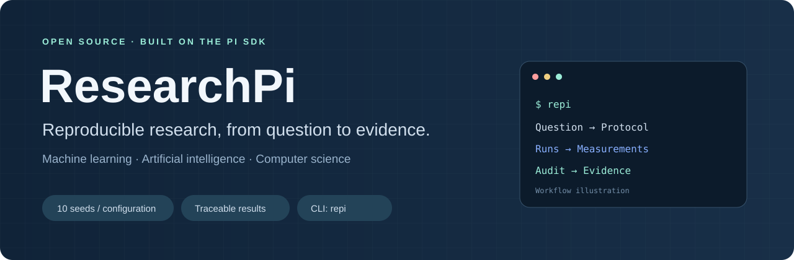
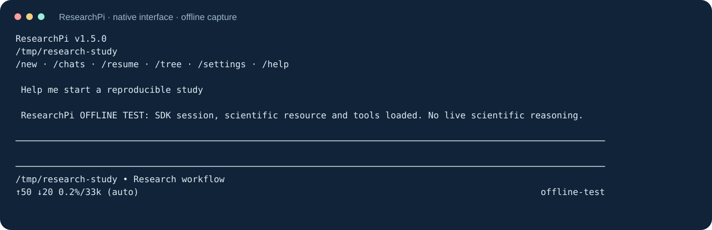
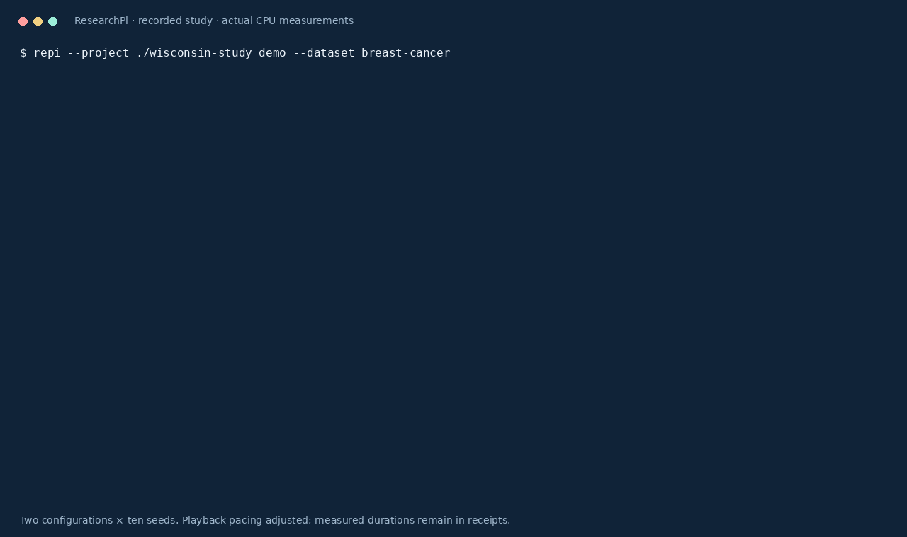

<p align="center"></p>

<p align="center">
<a href="https://github.com/rubenfb23/research-pi/actions/workflows/check.yml"></a>
<a href="https://github.com/rubenfb23/research-pi/actions/workflows/packages.yml"></a>
<a href="https://github.com/rubenfb23/research-pi/releases"></a>
<a href="LICENSE"></a>
</p>

**An open-source research harness for machine learning, AI and computer science, built on the [Pi SDK](https://github.com/earendil-works/pi).**

Start with `repi`. Develop a research question, retrieve sources, freeze an experiment, run ten predefined training seeds per configuration, and connect measured results to manuscript drafts. ResearchPi brings scientific workflows and persistent evidence into a terminal agent.

[Project website](https://rubenfb23.github.io/research-pi/) · [Quickstart](docs/quickstart.md) · [Workflows](docs/workflows.md) · [CLI guide](docs/cli-guide.md) · [Comparison](docs/comparison.md) · [Verification](docs/status.md) · [Roadmap](ROADMAP.md)

Evaluate controlled same-model research workflows with `repi bench research run`. These generated tasks compare component ablations, not complete native products. [Benchmark protocol](docs/research-benchmark.md).

The experimental `repi bench index` track adds a frozen five-domain research rubric, a fixed-reference 0–100 rating, provenance receipts and native DeepSeek/GLM development calibration. It keeps incomplete coverage unranked and final holdout scores blocked pending required independent expert review. [Commands and limits](scripts/research-index/README.md) · [Index design](docs/research/research-agent-index-proposal.md).

For a first evaluation on published scientific tasks, `repi bench official --dataset <prepared-directory>` runs the full native CLI on an isolated Linux CPU subset of MLAgentBench and CORE-Bench Extended/OOD. It compares DeepSeek V4.1 Flash and GLM-5.3 Flash using OpenCode Go, separate graders and fresh replay containers. [Setup and limitations](scripts/official-bench/README.md) · [Executed model comparison](docs/research/deepseek-vs-glm-research-pilot.html). This small pilot does not establish model or harness superiority.



*Actual native interface capture with offline test responses; empty screen rows are compacted. [Replayable recording](assets/terminal.cast); live provider reasoning is shown only when the provider exposes it. The header graphic illustrates the workflow.*

## Start in your terminal

Download an installer from [Releases](https://github.com/rubenfb23/research-pi/releases): Ubuntu/Debian x64 `.deb`, Windows x64 `.exe`, or macOS Intel/Apple Silicon `.pkg`. Packages include Node.js and retained dependency notices.

```sh
# Ubuntu / Debian: install the downloaded package
sudo apt install ./research-pi_<version>_amd64.deb
repi
```

On Windows or macOS, open the installer, then start `repi` in a new terminal. From source, use Node.js ≥22.19:

```sh
git clone https://github.com/rubenfb23/research-pi.git
cd research-pi
npm run install:cli
repi
```

Choose a connection on first launch, or use `repi connect opencode-go`, `repi connect claude`, or `repi connect codex`. Claude uses an API key; Claude Pro/Max login is not implemented. The Codex connection uses Pi's OpenAI/ChatGPT authentication, rather than launching Codex CLI; account access requires a real response to verify. [Connections](docs/connections.md).

Update the embedded Pi SDK with `repi update`; use `repi update --check` to inspect available versions. The updater installs a candidate, compiles ResearchPi, and verifies an offline response and tool call before activation. A failed check keeps the previous runtime active. Source installations also run SDK/session/CLI/connection regression tests. Restart open chats after updating. [Update details](docs/updates.md).

Native installers are unsigned and macOS packages are not notarized. Python 3.14 with venv support is required for experiments and installed separately. The project is not published to npm. [Installation and checksums](docs/installation.md).

## Run a complete study

No model account is needed for the scientific execution path:

```sh
repi --project ./wisconsin-study demo --dataset breast-cancer
repi --project ./wisconsin-study audit
repi --project ./wisconsin-study aggregate
```

This runs **20 actual CPU fits: two configurations × ten seeds** on the Wisconsin Diagnostic Breast Cancer dataset included in scikit-learn. The dataset has 569 observations and 30 features; its original [UCI record](https://doi.org/10.24432/C5DW2B) is licensed CC BY 4.0. This small classification example is an educational study, not clinical validation.

The study keeps a frozen protocol, environment/code fingerprints, individual receipts, predictions, raw metrics, aggregation and a manuscript scaffold under `.research-pi/`. Resuming completed work does not repeat successful seeds. Use a new directory after code/dependency changes. Dispersion across training seeds describes variability on a fixed dataset/split, not population uncertainty or statistical significance.



[Inspect the measured results table](assets/study.svg) · [Replayable study recording](assets/study.cast)

*Generated from an actual twenty-run study. [Capture provenance](assets/capture-manifest.json) identifies its protocol, table and code hashes. This is a reproducibility example, not a comparison with other agents.*

## Bring your research

| Workflow | What ResearchPi provides |
| --- | --- |
| Experiments | Synthetic or real built-in data, numeric binary CSV, frozen custom Python adapters, ten-seed receipts and prediction-derived metrics |
| Literature | Direct public-source reading, installed Chrome/Chromium/Edge, Crossref discovery and DOI/metadata comparisons with retained evidence |
| Causal planning | Estimand → assumptions → identification → estimation plan → robustness → bounded conclusions; completeness checks require scientific review |
| Papers | Editorial policy, five article profiles, evidence-linked methodology/results, numerical provenance and bibliographic checks |
| Terminal work | Native Pi tools, streaming, Markdown/math display, completion, clipboard, resources/MCP and saved conversations |

```sh
repi doctor
repi --project ./my-study init --custom-method ./examples/custom-classifier.py \
  --method-description "Training-only standardization and seeded SGD"
repi --project ./my-study run
repi references verify --file ./examples/reference.json
repi chats list --all
```

[Three reproducible workflows](docs/workflows.md) cover CSV, custom methods, source checks and manuscript artifacts. Tool availability and prompt delivery do not establish universal scientific judgment. Custom code runs with host-user permissions, and hash checks detect consistency problems rather than adversarial tampering. [Integrity boundaries](docs/integrity.md).

## ResearchPi, Claude Code and Codex

ResearchPi focuses on a persistent scientific workflow with dedicated experiment and evidence tools. Claude Code and Codex also support research through code execution, instructions and integrations. [Our comparison](docs/comparison.md) distinguishes capabilities, configuration and observed evidence.

```sh
# List the closed-input research microtasks
repi bench tasks
# Check evaluation infrastructure without a model account
repi --project ./bench-smoke bench run --agent fixture
# Run real agents with existing authentication; may consume account usage
repi --project ./bench-repi bench run --agent repi --trials 10
```

The runner supports ResearchPi, Claude Code and Codex and records task inputs, versions, responses, failures, duration and exposed usage. The initial suite contains twenty synthetic microtasks, not a full scientific-quality benchmark. Fixture results are explicitly excluded from model-performance claims. [Evaluation protocol](docs/benchmarks.md).

## Contribute

Bug fixes, scientific adapters, attributed expert notes and reproducible evaluation tasks are welcome. Read [CONTRIBUTING.md](CONTRIBUTING.md), [CODE_OF_CONDUCT.md](CODE_OF_CONDUCT.md), [SECURITY.md](SECURITY.md) and the [roadmap](ROADMAP.md). Report problems or propose workflows through [Issues](https://github.com/rubenfb23/research-pi/issues).

```sh
npm ci
node repi setup --experiments
npm run check
```

CI exercises real scientific fits and native install/chat/resume/removal on Linux, Windows and both macOS architectures. [Verified capabilities and remaining work](docs/status.md) keeps simulated transport checks separate from live model evidence. An upstream Pi dependency advisory remains documented; no clean dependency audit is claimed.

## License and citation

Original ResearchPi code is [MIT licensed](LICENSE), © 2026 Ruben Fernandez Boullon. Pi is an SDK dependency; its [MIT notice](docs/Pi-LICENSE.txt) and other [third-party notices](THIRD_PARTY_NOTICES.md) are retained. Referenced scientific publications and datasets keep their own rights and licenses.

Use [CITATION.cff](CITATION.cff) to cite the software and record the version/source revision used in your study. [Changelog](CHANGELOG.md) · [Release process](docs/releases.md).

All interface text, documentation, bundled research instructions and default generated scientific text are in English.
